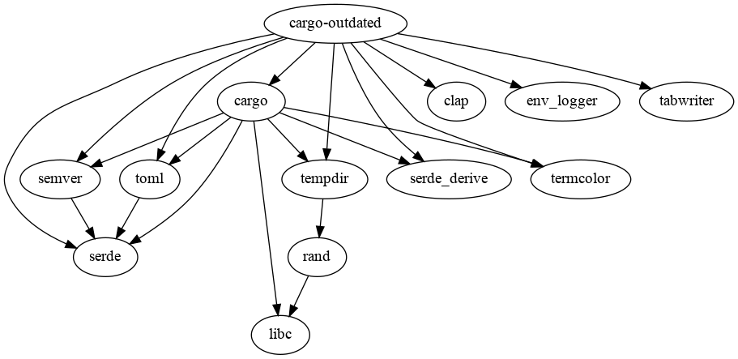

# cargo-outdated

[](https://gitter.im/kbknapp/cargo-outdated?utm_source=badge&utm_medium=badge&utm_campaign=pr-badge&utm_content=badge) [](https://crates.io/crates/cargo-outdated)
Linux: [](https://travis-ci.org/kbknapp/cargo-outdated)

A cargo subcommand for displaying when Rust dependencies are out of date

## About

`cargo-outdated` is for displaying when dependencies have newer versions available.

## How it works

The functionality of `cargo-outdated` largely depends on the `cargo` builtin command `cargo update`.

To retrieve the list of available SemVer compatible dependencies, `cargo-outdated` firstly creates a temporary workspace, then executes `cargo update` against it, finally compares the temporary dependency tree with the original one.

Similarly, to check the latest dependencies, `cargo-outdated` replaces the SemVer requirements of *direct* dependencies with wildcards then goes through the same process.

## Demo

Once installed (see below) running `cargo outdated` in a project directory looks like the following:

```
$ cargo outdated
Name             Project  Compat  Latest   Kind         Platform
----             -------  ------  ------   ----         --------
clap             2.20.0   2.20.5  2.26.0   Normal       ---
clap->bitflags   0.7.0    ---     0.9.1    Normal       ---
clap->libc       0.2.18   0.2.29  Removed  Normal       ---
clap->term_size  0.2.1    0.2.3   0.3.0    Normal       ---
clap->vec_map    0.6.0    ---     0.8.0    Normal       ---
num_cpus         1.6.0    ---     1.6.2    Development  ---
num_cpus->libc   0.2.18   0.2.29  0.2.29   Normal       ---
pkg-config       0.3.8    0.3.9   0.3.9    Build        ---
term             0.4.5    ---     0.4.6    Normal       ---
term_size->libc  0.2.18   0.2.29  0.2.29   Normal       cfg(not(target_os = "windows"))
```

## Installing

`cargo-outdated` can be installed with `cargo install`

```
$ cargo install cargo-outdated
```

## Compiling

Follow these instructions to compile `cargo-outdated`, then skip down to Installation.

 1. Ensure you have current version of `cargo` and [Rust](https://www.rust-lang.org) installed
 2. Clone the project `$ git clone https://github.com/kbknapp/cargo-outdated && cd cargo-outdated`
 3. Build the project `$ cargo build --release`
 4. Once complete, the binary will be located at `target/release/cargo-outdated`

## Installation and Usage

All you need to do is place `cargo-outdated` somewhere in your `$PATH`. Then run `cargo outdated` anywhere in your project directory. For full details see below.

### Linux / OS X

You have two options, place `cargo-outdated` into a directory that is already located in your `$PATH` variable (To see which directories those are, open a terminal and type `echo "${PATH//:/\n}"`, the quotation marks are important), or you can add a custom directory to your `$PATH`

**Option 1**
If you have write permission to a directory listed in your `$PATH` or you have root permission (or via `sudo`), simply copy the `cargo-outdated` to that directory `# sudo cp cargo-outdated /usr/local/bin`

**Option 2**
If you do not have root, `sudo`, or write permission to any directory already in `$PATH` you can create a directory inside your home directory, and add that. Many people use `$HOME/.bin` to keep it hidden (and not clutter your home directory), or `$HOME/bin` if you want it to be always visible. Here is an example to make the directory, add it to `$PATH`, and copy `cargo-outdated` there.

Simply change `bin` to whatever you'd like to name the directory, and `.bashrc` to whatever your shell startup file is (usually `.bashrc`, `.bash_profile`, or `.zshrc`)

```sh
$ mkdir ~/bin
$ echo "export PATH=$PATH:$HOME/bin" >> ~/.bashrc
$ cp cargo-outdated ~/bin
$ source ~/.bashrc
```

### Windows

On Windows 7/8 you can add directory to the `PATH` variable by opening a command line as an administrator and running

```sh
C:\> setx path "%path%;C:\path\to\cargo-outdated\binary"
```

Otherwise, ensure you have the `cargo-outdated` binary in the directory which you operating in the command line from, because Windows automatically adds your current directory to PATH (i.e. if you open a command line to `C:\my_project\` to use `cargo-outdated` ensure `cargo-outdated.exe` is inside that directory as well).


### Options

There are a few options for using `cargo-outdated` which should be somewhat self explanatory.

```
USAGE:
    cargo outdated [FLAGS] [OPTIONS]

FLAGS:
    -a, --aggressive             Ignores channels for latest updates
    -h, --help                   Prints help information
    -q, --quiet                  Suppresses warnings
    -R, --root-deps-only         Only check root dependencies (Equivalent to --depth=1)
    -V, --version                Prints version information
    -v, --verbose                Use verbose output
    -w, --workspace              Checks updates for all workspace members
                                 rather than only the root package

OPTIONS:
        --color <color>           Coloring: auto, always, never [default: auto]
                                  [values: auto, always, never]
    -d, --depth <NUM>             How deep in the dependency chain to search
                                  (Defaults to all dependencies when omitted)
        --exit-code <NUM>         The exit code to return on new versions found [default: 0]
        --features <FEATURE>      Space-separated list of features
    -m, --manifest-path <PATH>    An absolute path to the Cargo.toml file to use
                                  (Defaults to Cargo.toml in project root)
    -p, --packages <PKG>...       Package to inspect for updates
    -r, --root <ROOT>             Package to treat as the root package
```

## License

`cargo-outdated` is released under the terms of either the MIT or Apache 2.0 license. See the LICENSE-MIT or LICENSE-APACHE file for the details.

## Dependencies Tree

